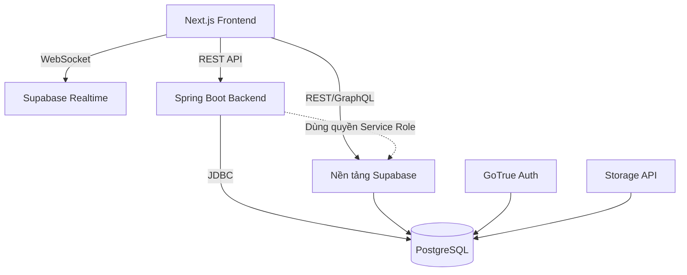

# Kiến trúc Hệ thống (Architecture)

**Supabase Ultimate Showcase** được thiết kế để trình diễn cách một ứng dụng fullstack hiện đại có thể tận dụng toàn bộ sức mạnh của Supabase (làm cơ sở dữ liệu lõi, xác thực người dùng, và xử lý realtime), kết hợp với giao diện Next.js và backend Spring Boot (Java) cho các tác vụ phức tạp.

## Sơ đồ Hệ thống

## 1. Giao diện (Frontend - Next.js)
- **Vai trò**: Xử lý toàn bộ tương tác của người dùng, render giao diện, và kết nối trực tiếp đến các dịch vụ của Supabase (Xác thực, Realtime, và các thao tác CRUD cơ bản).
- **Công nghệ**: Next.js 15 (App Router), TypeScript, TailwindCSS, thư viện UI shadcn.
- **Lý do lựa chọn**: Next.js mang lại trải nghiệm phát triển tuyệt vời và tích hợp cực kỳ trơn tru với Supabase thông qua 2 thư viện `@supabase/supabase-js` và `@supabase/ssr`.

## 2. API Phân tích (Backend - Spring Boot)
- **Vai trò**: Chịu trách nhiệm xử lý các tác vụ phân tích nặng, nghiệp vụ phức tạp hoặc những luồng dữ liệu cần quản lý Transaction ở cấp độ doanh nghiệp (Enterprise). Module này là minh chứng rõ nét cho việc Supabase hoàn toàn có thể kết nối với hệ sinh thái Enterprise truyền thống.
- **Công nghệ**: Java 17/21, Spring Boot 3.3+, Spring Data JPA, Spring Security (để xác thực chuỗi JWT).
- **Lý do lựa chọn**: Khẳng định rằng Supabase không chỉ dành cho các framework JavaScript Serverless, mà còn đóng vai trò là một CSDL PostgreSQL chuẩn mực, mạnh mẽ cho bất kỳ backend truyền thống nào.

## 3. Cơ sở dữ liệu (Supabase / PostgreSQL)
- **Vai trò**: "Trái tim" của toàn bộ ứng dụng. Đây không chỉ là nơi lưu trữ dữ liệu tĩnh đơn thuần; nó chứa đựng rất nhiều logic nghiệp vụ được lập trình sẵn bên trong qua RLS, Triggers (Trình kích hoạt), và Functions (Hàm CSDL).
- **Các tính năng đã triển khai**:
  - Bảo mật cấp độ dòng dữ liệu (Row Level Security - RLS)
  - Tự động sinh API từ CSDL (PostgREST)
  - Tìm kiếm ngữ nghĩa bằng AI (pgvector)
  - Lắng nghe thay đổi dữ liệu theo thời gian thực (Realtime subscriptions)
  - Lưu trữ dữ liệu siêu linh hoạt bằng định dạng JSONB
