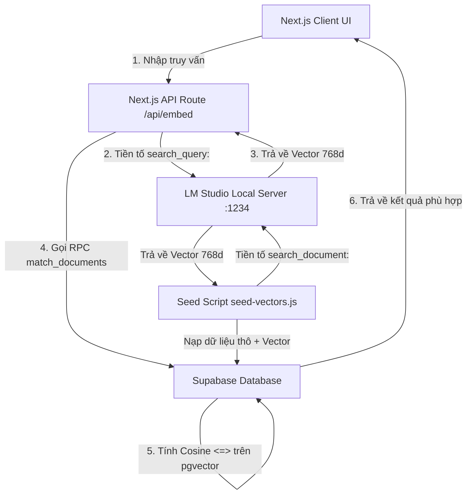

# Báo cáo Kỹ thuật: Hệ thống Tìm kiếm Ngữ nghĩa (AI Semantic Search v2)

Tài liệu này phân tích chuyên sâu về kiến trúc mới nâng cấp, cách triển khai mã nguồn, luồng dữ liệu và hướng dẫn cấu hình chi tiết cho tính năng Tìm kiếm Ngữ nghĩa (AI Semantic Search) sử dụng **pgvector** kết hợp với **Local Server LM Studio** chạy mô hình **Nomic Embed v1.5 (768 chiều)**.

---

## 1. Tổng quan công nghệ (Technology Overview)

Hệ thống Tìm kiếm Ngữ nghĩa (Semantic Search) cho phép tìm kiếm tài liệu dựa trên **ý nghĩa và ngữ cảnh** của câu hỏi thay vì đối khớp từ khóa thô (Keyword-based Search) như các truy vấn SQL `LIKE %...%` truyền thống.

### Bước nhảy vọt về kiến trúc (Từ v1 sang v2):
Trong phiên bản cũ (v1), hệ thống sử dụng thư viện `@xenova/transformers` để chạy mô hình `all-MiniLM-L6-v2` (384 chiều) trực tiếp trong CPU của luồng xử lý Node.js/Next.js. Điều này gây ra hiện tượng nghẽn luồng (blocking event loop) khi xử lý đồng thời nhiều truy vấn và bị giới hạn độ chính xác.

Phiên bản mới (**v2**) đã nâng cấp toàn diện:
- **Mô hình AI mới:** Chuyển sang mô hình **Nomic Embed v1.5** (phiên bản GGUF) - một trong những mô hình nhúng văn bản cục bộ tốt nhất hiện nay, tối ưu hóa mạnh mẽ khả năng hiểu ngữ nghĩa đa ngôn ngữ (bao gồm cả Tiếng Anh và Tiếng Việt).
- **Môi trường thực thi tách biệt:** Sử dụng ứng dụng **LM Studio** làm Local Inference Server. Next.js đóng vai trò API Gateway gọn nhẹ, đẩy việc tính toán vector hạng nặng sang LM Studio. LM Studio tận dụng hiệu quả tăng tốc phần cứng (GPU CUDA cho Nvidia, Metal cho Apple Silicon) giúp giảm độ trễ sinh vector xuống dưới **50ms**.
- **Không gian Vector lớn hơn:** Tăng độ dài vector từ **384 chiều** lên chính xác **768 chiều**, giúp tăng đáng kể mật độ thông tin biểu diễn ngữ nghĩa và cải thiện độ chính xác của kết quả tìm kiếm.

---

## 2. Kiến trúc Hệ thống mới (System Architecture)

Kiến trúc hệ thống được xây dựng theo mô hình dịch vụ tách biệt, tối ưu hóa hiệu năng giữa ứng dụng web và máy chủ tính toán AI.



### Các thành phần chính trong kiến trúc:
1. **Client Layer (Giao diện người dùng):** Giao diện Single Page Application (SPA) xây dựng bằng Next.js Client Component, gửi truy vấn và hiển thị kết quả kèm độ tương đồng (%) theo thời gian thực.
2. **API Route Layer (`/api/embed`):** Nhận truy vấn từ Client, chuẩn hóa định dạng, thêm tiền tố quy định và gọi sang Local Inference Server.
3. **Local AI Inference Server (LM Studio):** Máy chủ AI chạy ngầm trên máy cục bộ, lắng nghe ở cổng `1234`, tiếp nhận văn bản và sử dụng GPU/CPU để sinh vector nhúng nhanh chóng.
4. **Database Vector Store (Supabase / pgvector):** Lưu trữ văn bản cùng mảng vector `768` chiều, sử dụng chỉ mục (Index) **HNSW** và hàm RPC thực hiện tính toán khoảng cách Cosine trên cơ sở dữ liệu.

---

## 3. Hướng dẫn cấu hình hạ tầng (Prerequisites)

Để kích hoạt và sử dụng tính năng tìm kiếm ngữ nghĩa v2 này, bạn cần thiết lập **LM Studio** chạy mô hình **Nomic Embed v1.5** theo các bước sau:

### Bước 1: Cài đặt ứng dụng LM Studio
- Tải phiên bản cài đặt phù hợp với Hệ điều hành của bạn từ trang chủ: [https://lmstudio.ai/](https://lmstudio.ai/).
- Tiến hành cài đặt ứng dụng vào máy tính.

### Bước 2: Tải Mô hình Nomic Embed v1.5
- Mở LM Studio.
- Nhấp vào biểu tượng **Kính lúp (Search)** ở thanh menu bên trái.
- Nhập từ khóa tìm kiếm: `nomic-embed-text-v1.5`.
- Chọn mô hình từ nhà phát hành uy tín (ví dụ: tuyển chọn bản GGUF từ `nomic-ai/nomic-embed-text-v1.5-GGUF`).
- Tải tệp mô hình có lượng quantization phù hợp với RAM của bạn (khuyên dùng bản `Q4_K_M` hoặc `Q8_0` - dung lượng chỉ khoảng ~150MB - 300MB nhưng giữ nguyên độ chính xác cao).

### Bước 3: Cấu hình và Bật Local API Server
- Nhấp vào biểu tượng **Mũi tên hai chiều (Local Server)** ở menu bên trái (hoặc tab Developer).
- Trong hộp chọn mô hình ở trên cùng thanh điều hướng, hãy chọn mô hình **`nomic-embed-text-v1.5`** đã tải về để nạp vào RAM.
- Cấu hình mạng:
  - **Port:** Thiết lập chính xác là `1234`.
  - **Cài đặt Hardware:** Bật tăng tốc GPU (nếu máy có GPU rời Nvidia CUDA hoặc Apple Silicon) để đạt hiệu năng tối đa.
- Bấm nút **Start Server**.
- Đảm bảo màn hình hiển thị log thông báo máy chủ đang lắng nghe tại: `http://localhost:1234/v1/embeddings`.

---

## 4. Định dạng dữ liệu & Quy tắc tiền tố (Prefix Rules)

Mô hình **Nomic Embed v1.5** hoạt động hiệu quả nhất nhờ kỹ thuật phân biệt ngữ cảnh thông qua tiền tố bắt buộc (Task-specific Prefixes). Việc tuân thủ quy tắc này là bắt buộc để mô hình sắp xếp các vector trong không gian đa chiều một cách chính xác nhất:

1. **Quy tắc nạp dữ liệu nền (Document Indexing):**
   - Khi tạo vector đại diện cho một văn bản/sản phẩm để lưu vào Database, bạn **phải** thêm tiền tố `search_document: ` vào trước đoạn văn bản.
   - Ví dụ: `"search_document: UltraFast Gaming Laptop X9. High-performance gaming laptop with 14th gen..."`
2. **Quy tắc truy vấn tìm kiếm (Search Querying):**
   - Khi người dùng nhập từ khóa tìm kiếm, trước khi sinh vector truy vấn, bạn **phải** thêm tiền tố `search_query: ` vào trước từ khóa đó.
   - Ví dụ: `"search_query: máy tính chơi game tốt"`

---

## 5. Hạ tầng Database (PostgreSQL & pgvector)

### 5.1. Khởi tạo Bảng dữ liệu nâng cấp
Cột `embedding` trong bảng `documents` trên PostgreSQL được cấu hình với độ dài chính xác là **768** phần tử số thực.

```sql
-- Kích hoạt extension vector nếu chưa có
CREATE EXTENSION IF NOT EXISTS "vector";

-- Tạo bảng documents
CREATE TABLE public.documents (
    id uuid DEFAULT gen_random_uuid() PRIMARY KEY,
    title character varying(255) NOT NULL,
    content text NOT NULL,
    embedding vector(768), -- Sử dụng 768 chiều thay cho 384 chiều cũ
    created_at timestamp with time zone DEFAULT timezone('utc'::text, now()) NOT NULL
);

-- Khởi tạo chỉ mục HNSW (Hierarchical Navigable Small World) để tăng tốc độ truy tìm tương đồng trên hàng triệu bản ghi
CREATE INDEX ON public.documents USING hnsw (embedding vector_cosine_ops);
```

### 5.2. Hàm xử lý Tìm kiếm (RPC `match_documents`)
Hàm RPC trong CSDL được viết bằng ngôn ngữ PL/pgSQL để tối ưu hóa việc trả về kết quả tìm kiếm với kiểu dữ liệu đồng bộ cấu trúc đầu ra:

```sql
-- Xóa hàm cũ nếu tồn tại cấu trúc xung đột
DROP FUNCTION IF EXISTS match_documents;

-- Khởi tạo hàm match_documents mới
CREATE OR REPLACE FUNCTION match_documents (
  query_embedding vector(768), -- Vector truy vấn đầu vào (768 chiều)
  match_threshold float,       -- Ngưỡng tương đồng tối thiểu (0.0 -> 1.0)
  match_count int              -- Số lượng kết quả tối đa cần lấy
)
RETURNS TABLE (
  id uuid,
  title character varying(255),
  content text,
  similarity float
)
LANGUAGE plpgsql AS $$
BEGIN
  RETURN QUERY
  SELECT
    documents.id,
    documents.title,
    documents.content,
    (1 - (documents.embedding <=> query_embedding))::float AS similarity -- Phép toán tính Cosine Similarity
  FROM documents
  WHERE 1 - (documents.embedding <=> query_embedding) > match_threshold
  ORDER BY documents.embedding <=> query_embedding ASC -- Quét nhanh hơn bằng toán tử khoảng cách
  LIMIT match_count;
END;
$$;
```

---

## 6. Sơ đồ luồng dữ liệu chi tiết (Data Flow)

Luồng thực thi từ giao diện người dùng đến khi nhận được kết quả hiển thị diễn ra như sau:

1. **Client UI:** Người dùng gõ `"code mượt"` vào ô tìm kiếm và nhấn Enter.
2. **Next.js API Route (`/api/embed`):**
   - Frontend gửi POST request chứa `{ text: "code mượt" }` lên `/api/embed`.
   - API Route tiền xử lý chuỗi: thêm tiền tố `search_query: ` vào trước chuỗi tìm kiếm tạo thành `"search_query: code mượt"`.
3. **LM Studio API:**
   - API Route thực hiện HTTP POST gọi đến `http://localhost:1234/v1/embeddings` với payload:
     ```json
     {
       "model": "text-embedding-nomic-embed-text-v1.5",
       "input": "search_query: code mượt"
     }
     ```
   - LM Studio tính toán và trả về mảng Vector Embedding có kích thước **768 số thực**.
4. **Supabase Client Call:**
   - API Route trả vector về cho Client.
   - Client Component sử dụng thư viện `@supabase/supabase-js` để thực thi RPC:
     ```javascript
     const { data, error } = await supabase.rpc("match_documents", {
       query_embedding: embedding, // Mảng 768 số thực
       match_threshold: 0.1,
       match_count: 5
     });
     ```
5. **PostgreSQL Execution:**
   - Supabase nhận mảng vector, truyền vào hàm `match_documents`.
   - pgvector so khớp vector này với các vector đã lưu trữ trong bảng `documents` bằng chỉ mục HNSW qua khoảng cách Cosine.
   - Trả về danh sách chứa đúng cấu trúc: `id`, `title`, `content`, `similarity`.
6. **Client Render:** Giao diện nhận mảng JSON kết quả, chuyển đổi `similarity` sang tỷ lệ phần trăm (ví dụ: `87.5%`) và hiển thị trực quan lên màn hình.

---

## 7. Hướng dẫn nạp dữ liệu nền (Database Seeding)

Khi khởi động dự án lần đầu, bảng `documents` sẽ trống trơn. Để nạp hàng trăm sản phẩm mẫu đã được vector hóa sang 768 chiều, hãy làm theo hướng dẫn dưới đây:

### Bước 1: Đảm bảo các dịch vụ đang hoạt động
- Đảm bảo **Supabase Local** đã được bật (`npx supabase start`).
- Đảm bảo ứng dụng **LM Studio** đã bật Local Server tại cổng `1234` và đã nạp mô hình `nomic-embed-text-v1.5`.

### Bước 2: Thực thi lệnh nạp dữ liệu
Di chuyển terminal vào thư mục `frontend` và khởi chạy script nạp vector:

```bash
cd frontend
node scripts/seed-vectors.js
```

### Bước 3: Xem cơ chế hoạt động của Script
- Script sẽ đọc danh sách hơn 200 sản phẩm mẫu (bao gồm cả Tiếng Anh và Tiếng Việt).
- Với mỗi sản phẩm, script tự động gộp dữ liệu: `${title}. ${content}`.
- Thêm tiền tố `search_document: ` vào trước đoạn text đó.
- Gửi HTTP request đến LM Studio để nhận về vector 768 chiều.
- Dùng quyền đặc trị `Service Role Key` của Supabase để đẩy thẳng dòng dữ liệu bao gồm `title`, `content` và `embedding` (vector 768 số) vào bảng `documents` mà không bị chặn bởi RLS.

---

## 8. Hướng phát triển trong tương lai (Future Enhancements)

Nếu muốn tiếp tục tối ưu hóa hệ thống tìm kiếm này lên quy mô doanh nghiệp:
1. **Matryoshka Representation Learning (MRL):** Mô hình Nomic Embed v1.5 hỗ trợ rút gọn kích thước vector linh hoạt (ví dụ: từ 768 chiều xuống 512, 256 hay 128 chiều) mà không mất đi quá nhiều độ chính xác. Điều này giúp giảm đáng kể dung lượng lưu trữ CSDL và tăng tốc truy vấn.
2. **Tìm kiếm lai (Hybrid Search):** Kết hợp Full-Text Search của PostgreSQL (`tsvector` & `tsquery`) với Semantic Search thông qua thuật toán RRF (Reciprocal Rank Fusion) để đạt độ chính xác cao nhất cho cả từ khóa thương hiệu, mã SKU sản phẩm và câu hỏi mô tả ý nghĩa.
3. **Chunking nâng cao:** Triển khai phương pháp cắt nhỏ tài liệu theo cấu trúc ngữ nghĩa (Semantic Chunking) thay vì ghép thô tiêu đề và mô tả, giúp xử lý các tài liệu dài hàng chục trang cực kỳ hiệu quả.iếm lai (Hybrid Search)
- **Vấn đề:** Đôi khi người dùng gõ mã sản phẩm (Ví dụ: `SKU-12345`). Semantic Search có thể tính toán ý nghĩa sai đối với các dải số/mã vạch.
- **Giải pháp:** Kết hợp **Full-Text Search (tsvector)** truyền thống của Postgres với **Semantic Search**. Bắn cả 2 truy vấn cùng lúc, sau đó dùng thuật toán RRF (Reciprocal Rank Fusion) để trộn điểm của cả 2 lại với nhau, mang lại kết quả đúng nhất cả về "ý nghĩa" lẫn "mã từ khóa".

### 4.3. Quản lý hàng đợi khi nhồi dữ liệu (Queue System)
- **Vấn đề:** Hiện tại script `seed-vectors.js` nạp bằng vòng lặp `for`. Nếu DB có 1 triệu sản phẩm, server Next.js sẽ bị quá tải RAM (Out of Memory) khi chạy AI để nhúng từng cái một.
- **Giải pháp:** Tách việc tạo Vector ra thành một Job chạy ngầm (Background Job). Sử dụng `BullMQ` hoặc tính năng Webhooks của Supabase để cứ khi nào có 1 Product mới được thêm vào DB -> Đẩy sang hàng đợi -> Máy chủ AI từ từ xử lý và tự động Update lại cột `embedding` sau.
